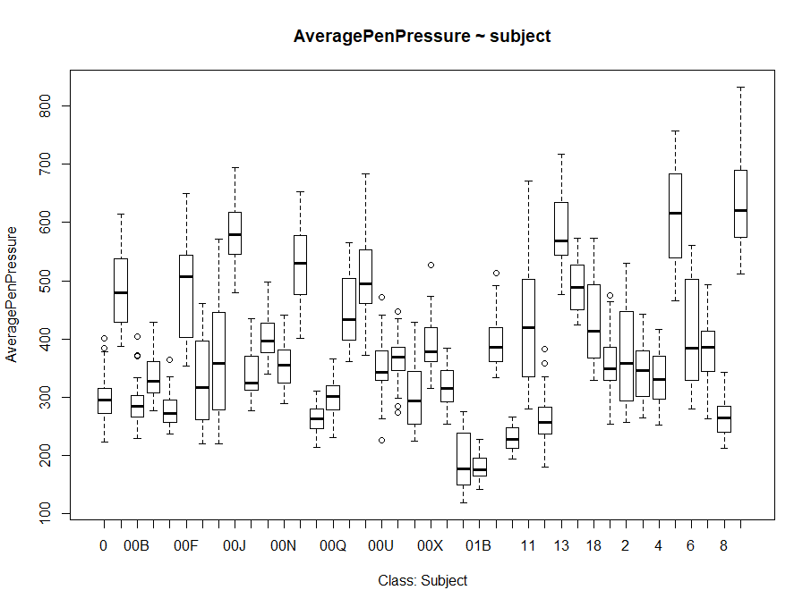
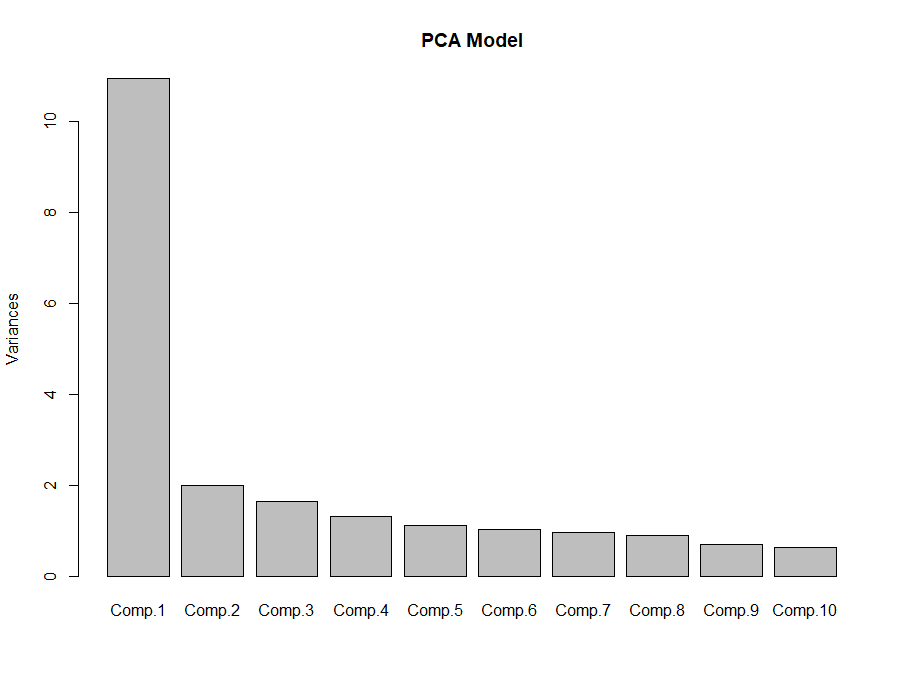
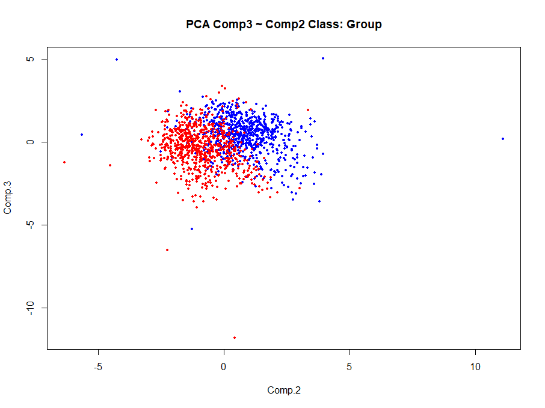
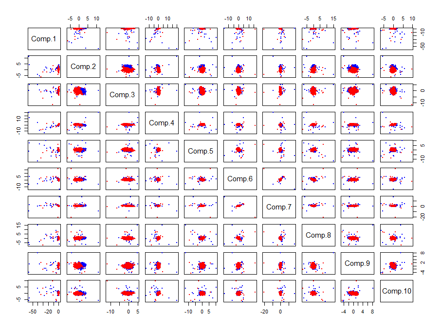

```{r, include=FALSE, echo=FALSE}
library(knitr)
knitr::opts_chunk$set(echo = FALSE, fig.align="center")
```


\newpage
\setlength\parindent{24pt}

The problem at hand is to answer the question of whether it is possible to build a reasonably accurate classifier that predicts three things simultaneously: 1. The writer of a short note (40 writers) 2. Which of 6 phrases is written 3. Whether the line is written in cursive or print using the kinematic features recorded by MovAlyzer. To begin the analysis we will do a brief investigation of the structure of the data to look for any apparent interactions or signals. We will also use principle component analysis to explore representations of higher order interactions or signals in lower dimensional space. Next we will train several classifiers using LDA, KNN, MclustDA, and Random Forest algorithms. Finally, we will use the findings of these classifiers to select the best approach for building a reasonbly accurate classifier for all three independent variables. It is important to note that because the goal is to prove whether a solution to this problem exists, most fine tuning will be left for future endeavors as we will prioritize breadth of analysis over depth.
  
We begin our analysis by examining the relationship of each dependent variable with each of the three independent variables. It should be noted briefly that the MovAlyzer data is recorded such that each row corresponds to one segment of one letter on a line. For our purposes, however, in the interest of computational efficiency we collapse this data to the unique trial level. We accomplish this using mean vectors so that each row corresponds to the unique combinations of group, subject, condition, trial and the corresponding data is the mean of all segments in that combination. For the most part, there is little discernable seperation between the classes for any combination of dependent and independent variables. The one exception, shown in \textbf{Figure 1}, is the relationship between RelativePendownDuration and Group. This makes sense intuitively as cursive writing entails far fewer lifts of the pen than print and it indicates a clear signal for classifying Group. There are some other variations and possible groupings present in some of the other relationships, such as in \textbf{Figure 2}, however, no clear signals or patterns are detectable.
  
Next we use principle component analysis to look for higher order signals and interactions within the data in reduced dimensions. All PCA components are orthogonal, therefore, there is no correlation between the new covariates derived from PCA. Because of this, adding or removing components has a clear relation to the proportion of the variance that a model can explain. Due to the high variance within the covariates we build our PCA model using the correlation matrix, which is effectivley the same as scaling prior to conducting PCA. The plot of the variance explained by the first ten components of our PCA model is shown in \textbf{Figure 3}. An examination of some of the plots of the first 10 components, such as \textbf{Figure 4}, shows signs of clear signals between cursive and print writing. Further, the Pairs plot for Group in \textbf{Figure 5} seems to indicate that component 2 is capturing the difference between print and cursive writing. Attempting similar graphical analysis with the independent variable Condition (6 classes) using one verus the rest methodologies does not yield any meaningful insights. There appears to be some potential clustering but it is not clear. Finally, we do not pursue this method for the Subject variable as there are too many classes to reasonably represent the principle components graphically while staying within the scope of this question.
  
We now move on to build up classifiers to determine if there is a signal in the data worth pursuing further. We begin by constructing a very basic LDA model with 10 principle components to establish a baseline. Using cross-validation to obtain training accuracy, we first build up marginal classifiers to predict each independent variable seperately. We find that this approach returns a cross-validated accuracy of 0.879 for Group, 0.385 for Subject, and 0.303 for Condition. The results from Group are not surprising as the high accuracy is supported by the graphical indications of signals within the data. Despite the lower cross-validation accuracy for Subject and Condition the fact that both are much higher than the probabilities of random selection (0.025 and 0.16 respectively) suggests that there is some signal resonating from the data. We next build up a single model for predicting all three variables by factorializing the three independent variables into a single independent variable with 480 classes. This is a naive place to start because we only have 3 replicates per class at this level, however, in attempt to establish a baseline it will suffice. We find that the cross-validated accuracy (0.281) is worse than any of the marginal accuracy measures but is similar to Condition.
  
In attempt to circumvent the lack of replicates, we also build up a model which joins Group and Condition and predicts Subject marginally. While this method reduces the number of classes for each model to 12 and 40 respectively, the combined model fails to perform even half as well as the baseline. We also build up a classifier that combines the three marginal models, but this also fails to perform as well as the baseline. Therefore, we will use 0.281 as our baseline accuracy for predicting all three independent variables. 
  
With a baseline established, we next run our baseline LDA models through a loop to determine the optimal number of principal components for each model. This step provides significant improvement to all models, in particlar the joint class model which reaches an accuracy of 0.586 with 21 components. In general, most of the LDA models trained are optimized with about 20 out of 23 principle components explaining roughly 90% of the variance in the data.
  
Moving on from LDA we train a similar set of KNN models. Using cross-validation for simple fine tuning we follow similar methodology to determine the optimal number of principle components as was used for LDA. The KNN models trained tend to be optimized with fewer components (17-18) than the LDA models were. Within this model group both the Group and Condition marginal predictors outperformed the LDA models but the Subject classifier lagged behind substantially. While KNN models are known for their convenience when working with multiple classes, the high number of classes in the Subject variable combined with the low number of replicates likely resulted in the decreased performance.
  
We will also build up a class of models using MclustDA. Because we have not spent much time with feature selection or dimension reduction these models are computationally expensive. The performance of the marginal predictors was approximately on par with the optimized LDA models, but the joint classification model proved computationally prohibitive within the scope of this question. The marginal models were built using 10-fold cross-validation.
  
Finally, we attempt to fit a class of Random Forest models for our data using 10-fold cross-validation. This results in substantial improvement across all marginal classifiers, in particular for Condition. This is good news as Condition has been the variable that has proven the most difficult to classify thus far. That being said, the accuracy of the joint classifier, while better than the baseline, is much lower than our optimized LDA accuracy. Since random forests, by their nature, eliminate most correlation in the data, using principle components to train the models is a bit naive. Therefore, we also train a group of random forest classifiers using the mean vectors of the training data. For both sets of models we use cross-validation to select the best value for n.var which dicatates how many variables are randomly sampled for each random tree.
  
Now that we have several classes of models trained we evaluate their relative performances, shown in the table below, in order to select the best method of making joint predictions. Since Random Forests without PCA produces the best accuracy for each marginal classifier we build up a model that combines the three marginal predictors into one classifier. We will not pursue other combinations of marginal and joint classifiers due their extremely poor performance while establishing our baseline. We find that our new model has a cross-validated accuracy of 0.430. While this is far better than our baseline it is not as accurate as the LDA model built with 21 principle components and a joint independent variable with 480 classes. Therefore, we select the joint LDA model as our best model and estimate that the testing accuracy for predicting all three classes will be approximatlely 0.586. (Predictions can be made by running the predictions script after changing the value of the csv variable at the top of the script to the path for the file of unlabeled data).

```{r, echo=FALSE}
train.acc <- read.csv("train.acc.csv")
colnames(train.acc) <- c("", "LDA", "KNN", "MclustDA", "Random Forest PCA", "Random Forest")
rownames(train.acc) <- c("Group Marginal", "Subject Marginal", "Condition Marginal", "Joint classes")
train.acc <- train.acc[-1]
train.acc <- format(train.acc, digits = 3)
kable(train.acc, align ='cccccc')
```

  Through this analysis we have shown that there does appear to be some signal that would support the construction of a classifier for a combination of all three independent variables. This is supported both by graphical evidence and the accuracies achieved by our various classes of models. In particular, the LDA model seems to be picking up some interaction between the independent variables deep within the principle components, driving the joint classification accuracy to outperform the marginal accuracy for Condition. Therefore we conclude that our analysis suggests that there is a signal on which to predict all three classes. The next best steps would be to fine tune the random forest models and to see if the high marginal accuracies can be leveraged into better joint predictors. Additionally, further dimensionality reduction and maximizing the model degrees of freedom could open up MclustDA as another viable path for further detailed analysis.

\newpage

\begin{center}
\large\textbf{Appendix}
\end{center}

\begin{figure}[h]
  \includegraphics{boxplot.group.1.png}
  \caption{RelativePenDownDuration is the only single variable to show clear seperation within Group}
\end{figure}











